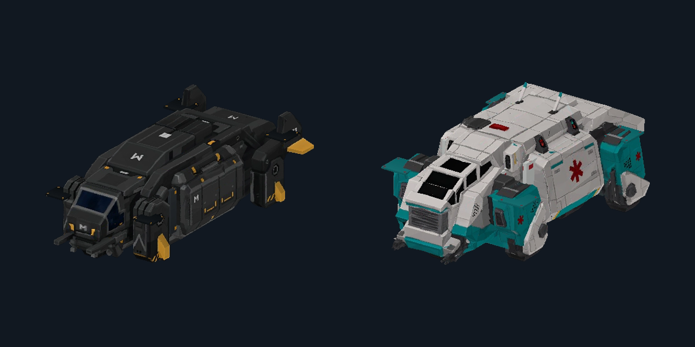
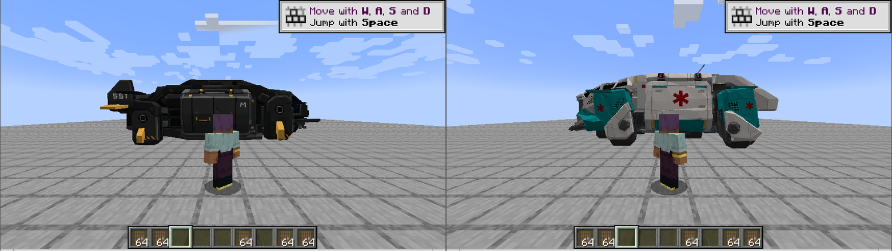
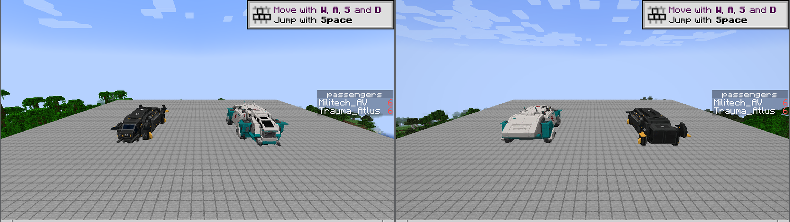
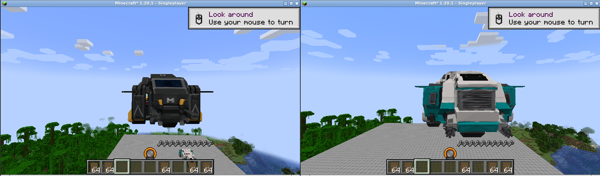
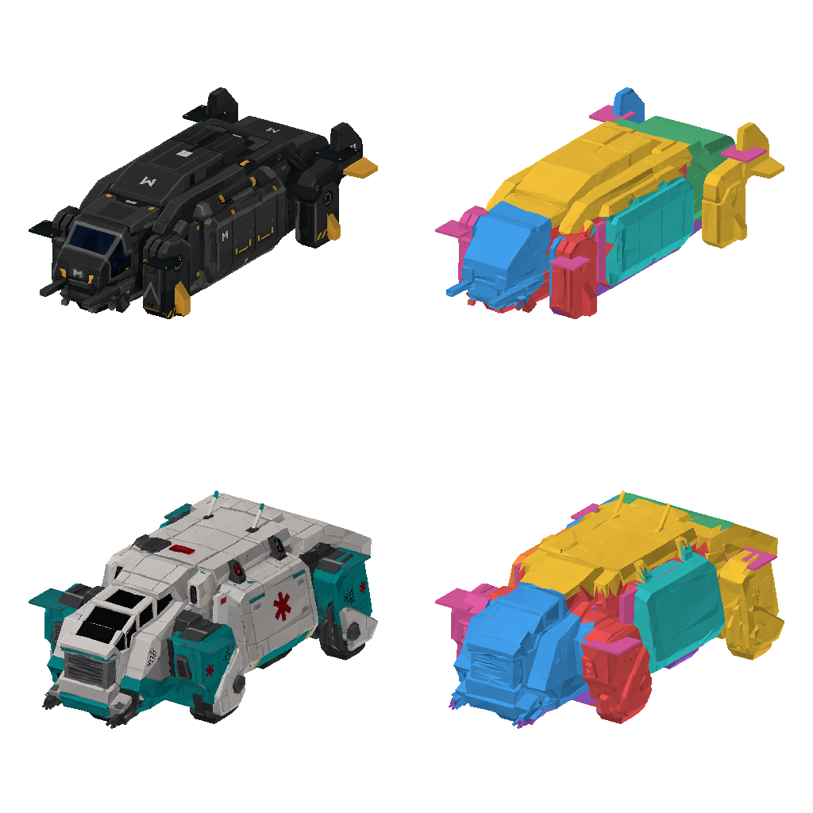

# Cyberpunk Hovercraft resource/data pack

This optional Minecraft 1.20.1 pack turns two existing Immersive Aircraft
vehicles into large futuristic VTOL aircraft without changing the mod's Java
source or JAR. Its resource-pack half supplies the models and textures; its
data-pack half supplies six-seat layouts and model-sized interaction hitboxes.



Player-scale check in a live Minecraft 1.20.1 client:



Six occupied seats on each aircraft, counted by the game while airborne:



Live flight check after boarding each aircraft and moving forward/upward:



| Resource-pack vehicle | Immersive Aircraft slot | Flight behavior |
| --- | --- | --- |
| Militech AV | Airship | 13.6 blocks long; fuel-powered hover/flight, six seats, and one weapon slot |
| Trauma Team Atlus | Cargo Airship | 13.6 blocks long; fuel-powered hover/flight, six seats, and cargo storage |

Minecraft resource packs cannot register new entity or item IDs. Reusing these
two existing slots is what makes the aircraft work with an unmodified Immersive
Aircraft JAR. Controls, sounds, inventories, and saved-vehicle behavior come
from the respective base vehicles. The data pack intentionally disables both
crafting recipes; obtain the aircraft from Creative inventory or with `/give`,
then use the item to place the aircraft in the world.

## Install

1. Build or install the `1.20.1` version of Immersive Aircraft.
2. Zip the contents of this `cyberpunk_hovercraft` directory, or use the
   directory directly.
3. Put the pack in the Minecraft `resourcepacks` directory and enable
   **Militech AV + Trauma Team Atlus** above the default assets.
4. Put the same pack in the world's `datapacks` directory, then run `/reload`.
   This enables all six seats and the full-size interaction hitboxes.
5. Take an Airship (Militech AV) or Cargo Airship (Trauma Team Atlus) from the
   Creative inventory, then use the item to place it in the world. They have no
   crafting recipes while this data pack is enabled.

The model replacement works with only the resource-pack half enabled, but the
base vehicles remain two-seaters until the same pack's data half is enabled.
No modified mod JAR is required.

## Controls and verification

Both aircraft inherit the Airship controls: **W/S** moves forward/backward,
**A/D** turns, **Space** rises, **Left Shift** descends, and **R** dismounts.
In a Fabric 1.20.1 client, each item was placed in-world, boarded by right-click,
flown vertically and forward with six occupants, and checked for a passenger
count of six. Both recipe IDs were also confirmed absent after data-pack reload.

## Blockbench and source files

The editable sources are in [`source/`](source/). The original Meshy exports
contained roughly 1.96 million triangles per aircraft, which is too dense for
Blockbench and real-time entity rendering. The checked-in optimized GLBs and
1024×1024 textures retain the recognizable source silhouettes, surface panels,
windows, landing gear, doors, and markings while remaining practical to render.

Blockbench does not import glTF in its core editor. Install the community
[glTF Importer](https://github.com/JannisX11/blockbench-plugins/tree/master/plugins/gltf_importer)
from Blockbench's Plugins dialog, then use **File → Import → glTF Model** to
open either `.glb`. The generated `.bbmodel` files do not need that plugin and
open directly.

The runtime files in `assets/immersive_aircraft/objects/` are native Blockbench
`.bbmodel` projects and open directly in Blockbench. The converter retains all
6,852 Militech and 6,770 Trauma Team source triangles and their original UVs.
The 1024×1024 maps receive a light, edge-preserving smoothing pass, reducing
surface noise without repainting or changing the original panel layout.

Each aircraft is organized as a multipart Blockbench rig rather than one flat
mesh. The outliner exposes the hull, cockpit, roof, rear section, landing gear,
left/right doors, and four VTOL pods. Seven recessed closure pieces sit behind
the original skin to block see-through seams around the cabin, doors, and pod
openings. The pod pivots tilt by eight degrees with forward/reverse input. There
are deliberately no generated rotor blades, fan bones, or fan animations.
Doors and landing gear remain independently selectable for future animation,
but the resource pack does not add new key bindings.

The final dimensions are intentionally vehicle-sized rather than player-sized:
the Militech AV is approximately 13.60 × 6.83 × 4.24 blocks and the Trauma Team
Atlus is approximately 13.60 × 7.99 × 5.30 blocks. Seat locations, interaction
hitboxes, weapon mounts, and exhaust trails are scaled with the models.

The right-hand renders below use diagnostic colors to show the individual
Blockbench mesh elements; the left-hand renders use the shipped textures.



To regenerate both runtime models and their panel atlases, run:

```bash
node tools/build_detailed_models.mjs
```

The build converts both GLBs, preserves their UV-mapped surfaces, applies the
1.7× scale, creates the smoothed maps and recessed panel textures, rigs the
editable parts, and writes both `.bbmodel` files. In both models the cockpit is
the forward end; the fins, rear deck, and exhaust points are on the back end.

`tools/render_bbmodel.mjs` creates a transparent preview for visual checks and
requires `ffmpeg`:

```bash
node tools/render_bbmodel.mjs \
  --model assets/immersive_aircraft/objects/airship.bbmodel \
  --texture assets/immersive_aircraft/textures/entity/militech_av_panels.png \
  --output /tmp/militech_av.png
```

Add `--part-colors true` to replace the texture with one diagnostic color per
element. This is useful for checking the semantic split and pod seams. Use
`--pod-tilt -8` to preview the articulated flight pose.

## Asset provenance

The Militech AV and Trauma Team Atlus GLBs were supplied by the contributor for
this pack. They depict third-party fictional designs. No separate license grant
for those two assets is asserted here; confirm redistribution rights before
publishing or merging them.
